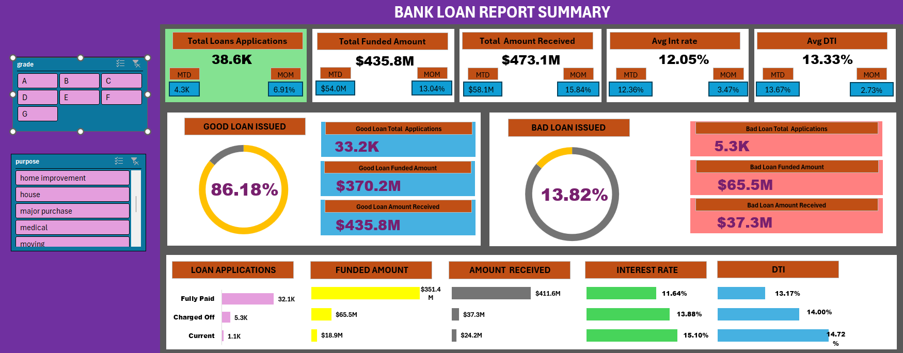
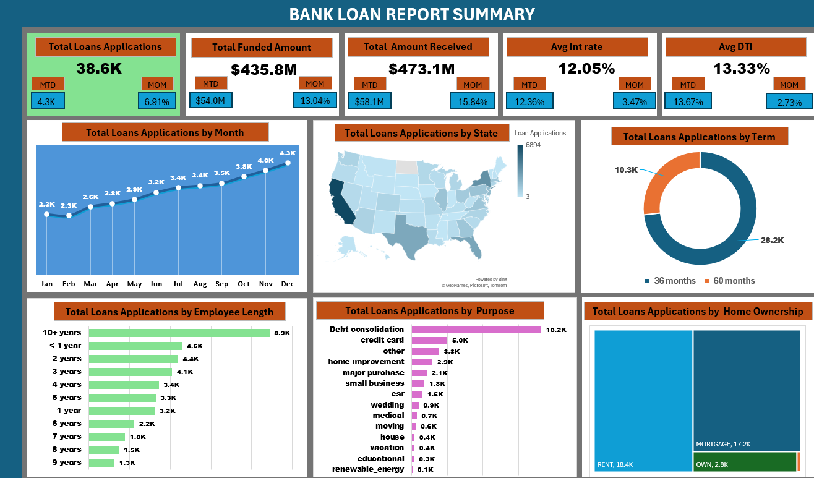
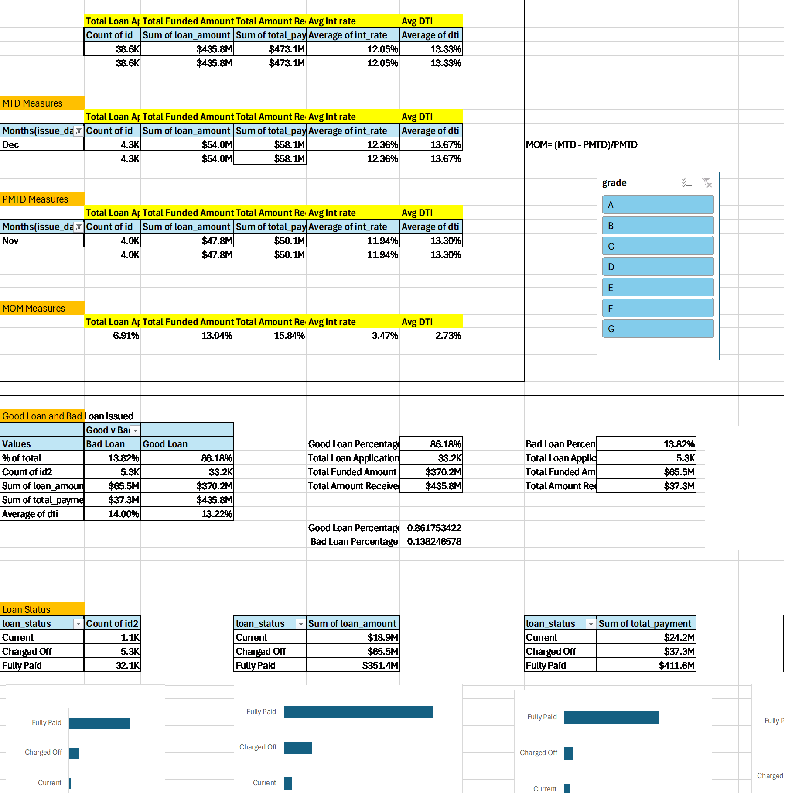

# Bank Loan Analytics Dashboard

> Exploring how raw lending data can be transformed into a structured portfolio intelligence system using Excel.

 

<table>
<tr>
<td width="33%">

### Lending Activity

Tracking how loan applications, funded amounts, and repayments evolve across borrower segments and time periods.

</td>

<td width="33%">

### Portfolio Quality

Separating healthy loans from risky lending categories to understand repayment quality and portfolio exposure.

</td>

<td width="33%">

### Borrower Segmentation

Analyzing how employment, ownership status, loan purpose, and geography influence lending behavior.

</td>
</tr>
</table>

  

## Inside the Dashboard

Rather than designing isolated Excel visuals, the project was structured as a connected reporting experience where different sections gradually move from high-level portfolio monitoring into borrower-level interpretation.

 

### Summary Layer

The first dashboard was designed to function as the operational command center of the project.

Key lending indicators such as funded amounts, repayments, interest rates, debt-to-income ratios, and application volumes were centralized into a KPI-driven reporting layer capable of tracking overall portfolio health.

The dashboard also introduced comparative lending analysis through:
MTD movement,
MoM variation,
and loan quality segmentation.

Instead of treating all loans equally, the reporting logic separates financially healthy loans from charged-off loans to create a more risk-oriented analytical view.

  

### Segmentation & Lending Distribution

The second dashboard shifts the focus toward lending behavior patterns.

At this stage, the analysis becomes less about totals and more about understanding how lending activity distributes itself across different borrower dimensions.

<table>
<tr>
<td width="50%">

#### Borrower Perspective

Employment length  
Home ownership  
Loan purpose  
Debt-to-income profile

</td>

<td width="50%">

#### Lending Perspective

Regional concentration  
Loan term distribution  
Funded amount trends  
Monthly lending movement

</td>
</tr>
</table>

 

This layer helped transform the project from a static reporting exercise into a more interpretive portfolio analysis workflow.

  

## Dashboard Architecture

Behind the presentation layer, the workbook contains the underlying reporting structure used to power the dashboards.

The backend logic includes:
pivot aggregation systems,
KPI calculations,
slicer interactions,
comparative monthly analysis,
and portfolio segmentation workflows.

One of the main design decisions was separating the analytical backend from the dashboard layer itself. This helped maintain cleaner visuals while keeping the reporting structure modular and easier to scale.

  

## Analytical Direction

What made this project interesting was realizing how much more meaningful financial datasets become once they are segmented properly.

Repayment patterns begin to change when viewed through loan status categories. Regional lending concentration reveals operational priorities. Borrower stability indicators start affecting interpretation once employment and ownership data are introduced into the analysis.

The dashboard gradually evolved from:
a collection of Excel charts

into:
a structured lending intelligence system focused on portfolio interpretation.

  

## Reflection

This project became one of my earliest attempts at combining:
business reporting,
interactive dashboard design,
portfolio analysis,
and analytical storytelling inside Excel.

More than the visuals themselves, the project helped me understand how dashboards are ultimately about organizing information in a way that supports interpretation and decision-making.